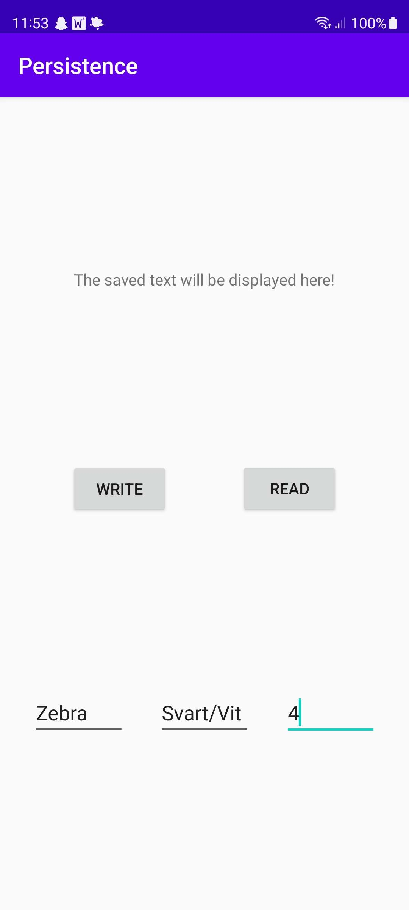
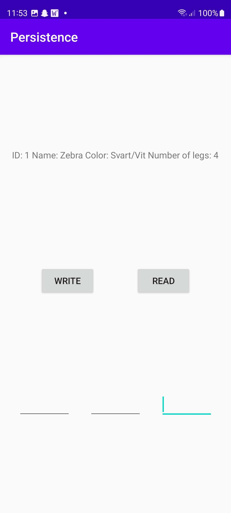
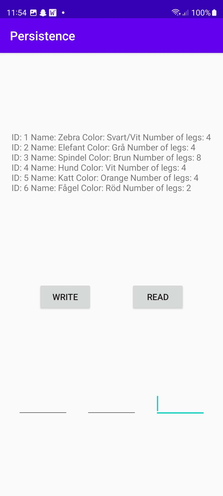

# Rapport

Jag har gjort en applikation där man kan skicka data till en databas och sedan visa upp det.
Denna applikation visar upp olika djur som har skickats in med namn, färg och antal ben.
Man skriver sin data längst ner, klickar sedan på "WRITE"-knappen för att skicka datan till
databasen. När man vill se datan klickan man på "READ"-knappen också visas den upp överst på
skärmen.

## Följande grundsyn gäller dugga-svar:

Koden nedan är för "WRITE"-knappen och den skickar datan som skrivits in till databasen.
```
writeButton.setOnClickListener(new View.OnClickListener() {
            @Override
            public void onClick(View view) {
                ContentValues values = new ContentValues();
                values.put(DatabaseTables.Animal.COLUMN_NAME_NAME, addName.getText().toString());
                values.put(DatabaseTables.Animal.COLUMN_NAME_COLOR, addColor.getText().toString());
                values.put(DatabaseTables.Animal.COLUMN_NAME_NUMBER_OF_LEGS, addNumberOfLegs.getText().toString());
                database.insert(DatabaseTables.Animal.TABLE_NAME, null, values);
                addName.setText("");
                addColor.setText("");
                addNumberOfLegs.setText("");
            }
        });
```

Koden nedan skriver ut all data från databasen via "READ"-knappen som sedan visas upp på skärmen.
```
readButton.setOnClickListener(new View.OnClickListener() {
            @Override
            public void onClick(View view) {
                Cursor cursor = database.query(DatabaseTables.Animal.TABLE_NAME, null, null, null, null, null, null);
                ArrayList<String> animals = new ArrayList<>();
                while (cursor.moveToNext()) {
                    animals.add("ID: " + cursor.getString(cursor.getColumnIndexOrThrow(DatabaseTables.Animal.COLUMN_NAME_ID)) +
                            " Name: " + cursor.getString(cursor.getColumnIndexOrThrow(DatabaseTables.Animal.COLUMN_NAME_NAME)) +
                            " Color: " +  cursor.getString(cursor.getColumnIndexOrThrow(DatabaseTables.Animal.COLUMN_NAME_COLOR)) +
                            " Number of legs: " + cursor.getString(cursor.getColumnIndexOrThrow(DatabaseTables.Animal.COLUMN_NAME_NUMBER_OF_LEGS)) + "\n");
                }
                String textAnimals = "";
                for (String string : animals){
                    textAnimals  = textAnimals + string;
                }
                readView.setText(textAnimals);
                cursor.close();
            }
        });
```

Koden nedan är den som skapar de olika tabellerna i databasen.
```
static class Animal {
        static final String TABLE_NAME = "animal";
        static final String COLUMN_NAME_ID = "id";
        static final String COLUMN_NAME_NAME = "name";
        static final String COLUMN_NAME_COLOR = "color";
        static final String COLUMN_NAME_NUMBER_OF_LEGS = "numberOfLegs";
    }

    static final String SQL_CREATE_TABLE_ANIMAL =
            // "CREATE TABLE animal (id INTEGER PRIMARY KEY, name TEXT, color TEXT, numberOfLegs TEXT)"
            "CREATE TABLE " + Animal.TABLE_NAME + " (" +
                    Animal.COLUMN_NAME_ID + " INTEGER PRIMARY KEY," +
                    Animal.COLUMN_NAME_NAME + " TEXT," +
                    Animal.COLUMN_NAME_COLOR + " TEXT," +
                    Animal.COLUMN_NAME_NUMBER_OF_LEGS + " INT)";
```

Koden nedan skapar ett databasnamn, i detta fall "Animal.db".
Koden under den körs endast om det inte redan finns en databas med samma namn som det över.
```
private static final String DATABASE_NAME = "Animal.db";

@Override
    public void onCreate(SQLiteDatabase sqLiteDatabase) {
        sqLiteDatabase.execSQL(DatabaseTables.SQL_CREATE_TABLE_ANIMAL);
    }
```

Bilden nedan visar hur det ser ut när man skriver in data för första gången.


Bilden nedan visar hur det ser ut när man visar upp den data som lagts in i databasen. 


Bilden nedan visar hur det ser ut när man visar upp en databas som börjats fylla. 
